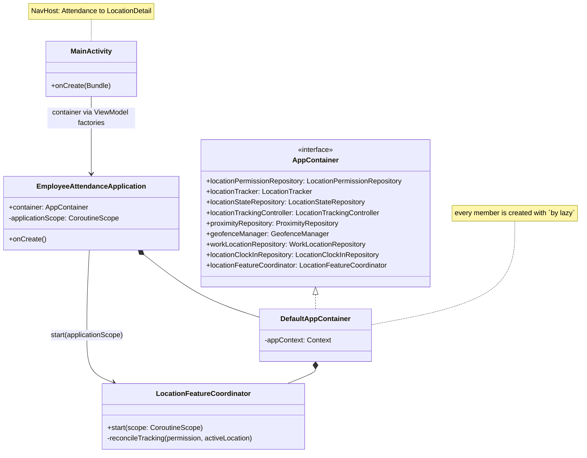
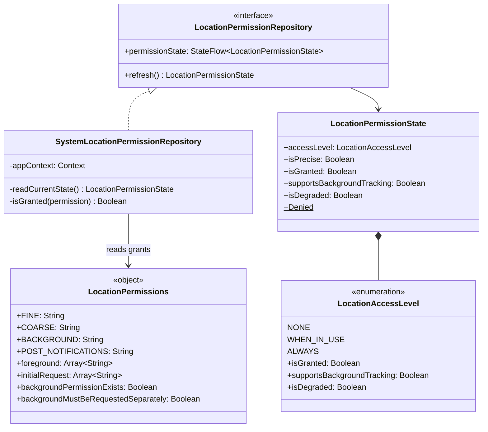
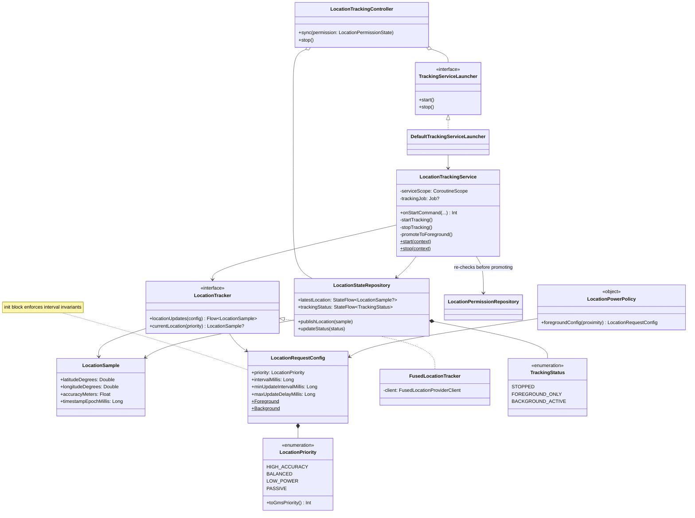
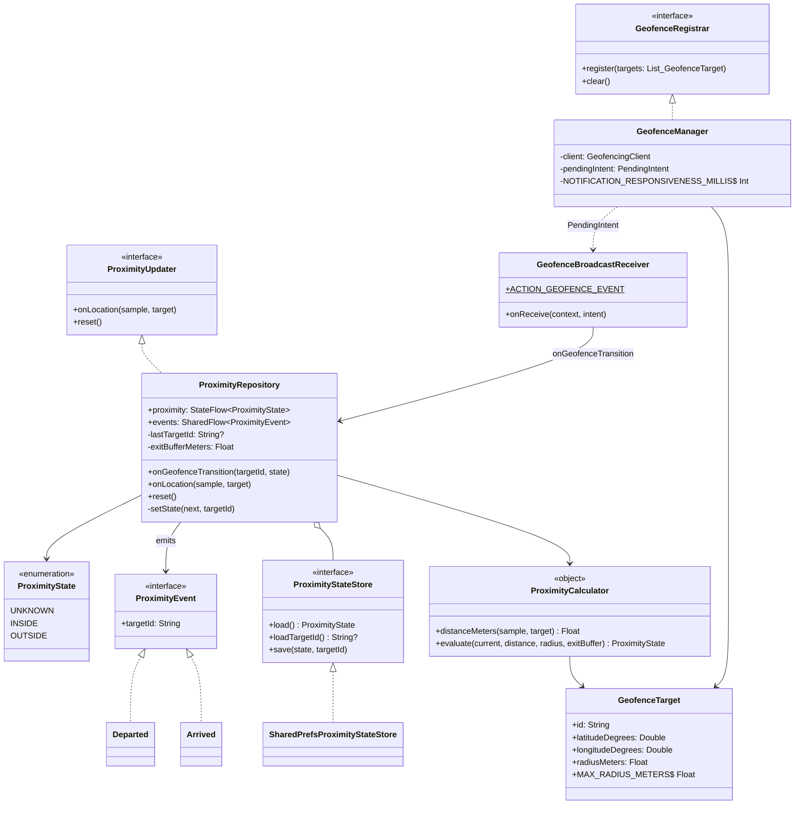
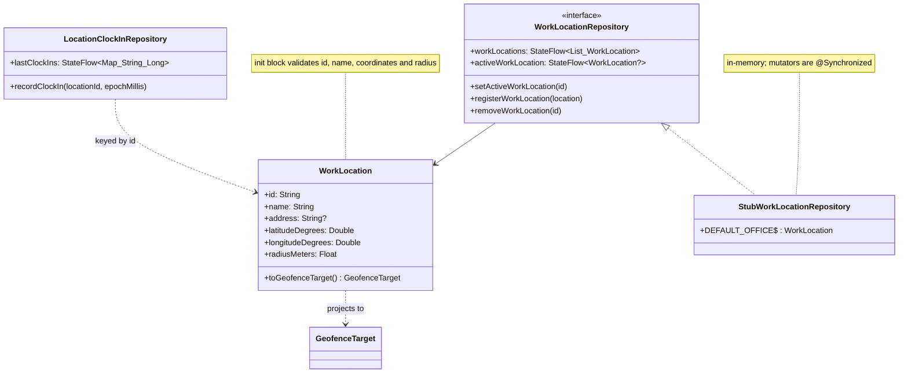
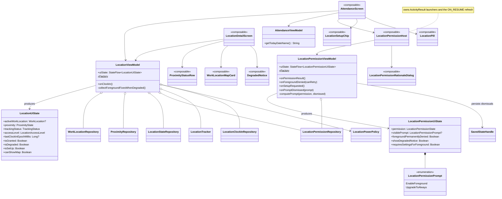
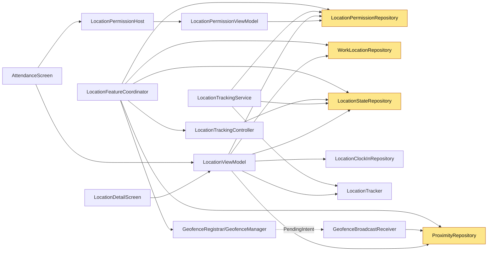

# Class Diagrams

UML class diagrams per package, plus one whole-feature dependency diagram. Members are trimmed to
what matters for understanding relationships — read the KDoc in the source for full signatures.

Notation: `<|--` implements/extends, `*--` composition (owner constructs it), `o--` aggregation
(injected, shared), `-->` uses/depends on.

---

## 1. App shell and dependency injection

---

## 2. `location.permission`

`LocationPermissions` is the **only** place Android version checks for the permission model live.
Any new SDK-gated permission rule belongs there, not scattered at call sites.

---

## 3. `location.tracking`

Two things to internalize here:

- `LocationStateRepository` is the **hand-off point**. Producers write; consumers read. It is why
  the rest of the app never needs to know whether the service or the ViewModel collector is running.
- `LocationTrackingController` holds the entire graceful-degradation policy. `ALWAYS` → start the
  service; `WHEN_IN_USE` → stop the service and report `FOREGROUND_ONLY`; `NONE` → stop and report
  `STOPPED`. It does **not** set `BACKGROUND_ACTIVE` — the service does that itself once it is
  actually collecting.

---

## 4. `location.proximity` and `location.geofence`

`ProximityRepository` is the single most coupled class in the app: two producers, two consumers
(`LocationViewModel`, and the unconsumed `events` seam), plus persistence. Change it carefully and
read `docs/maintenance/change-impact-map.md` first.

---

## 5. `location.registration`

`WorkLocation` → `GeofenceTarget` is the boundary between the **domain** model (has a name and
address, is shown to users) and the **geometric** model (what the proximity engine consumes). Keep
display concerns out of `GeofenceTarget`.

---

## 6. Presentation layer

`LocationUiState`'s derived properties (`isSetUp`, `canShowMap`, `isDegraded`) are where UI policy
lives. Composables branch on those, never on raw `accessLevel` comparisons — keep it that way so a
policy change is a one-line edit.

---

## 7. Whole-feature dependency graph

The single most useful picture for impact analysis: who depends on whom across the location feature.

The four amber nodes are **hubs** — three or more dependents each. A behavior change in any of them
propagates widely; see [../maintenance/change-impact-map.md](../maintenance/change-impact-map.md).
