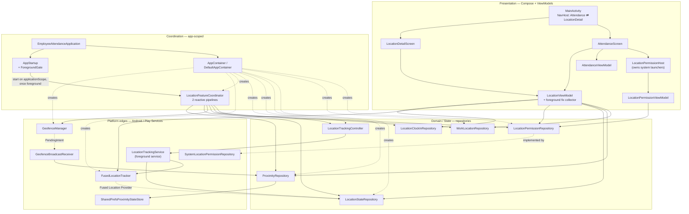

# Architecture Overview

## 1. Shape of the system

Single Gradle module (`:app`), single process, no DI framework, no persistence layer beyond
`SharedPreferences`. State flows one direction: platform sources → repositories → ViewModels →
stateless composables; user intent flows back as lambdas.

There are three things that make this app more interesting than a typical Compose sample, and every
one of them is a source of coupling you need to know about:

1. **Two producers of location, one consumer set.** A foreground `Service` (background permission)
   and a ViewModel-owned collector (foreground-only permission) both publish into the same
   `LocationStateRepository`. Consumers never know which one is running.
2. **Two producers of proximity, one state.** OS geofences (via a `BroadcastReceiver`) and in-app
   distance math both commit into the same `ProximityRepository`. It dedupes and emits one event
   stream.
3. **Process death is a first-class case.** Android cold-starts the process *just* to deliver a
   geofence transition, so proximity state is persisted to `SharedPreferences` and re-seeded on
   construction.

## 2. Layers



### Layer rules

| Layer | May depend on | Must never depend on |
| --- | --- | --- |
| Composables (`*Screen.kt`, `*Card.kt`, `LocationPill`, `LocationComponents`) | UI-state data classes, `R`, theme | repositories, `Context`-backed services, Play Services |
| ViewModels | repositories, seam interfaces | `Activity`, `Context`, permission launchers, composables |
| Coordination (`LocationFeatureCoordinator`) | seam interfaces (`GeofenceRegistrar`, `ProximityUpdater`) and repositories | concrete platform classes, UI |
| Repositories | domain models, store seams | ViewModels, composables |
| Platform edges | Android SDK, Play Services | ViewModels, composables |

`LocationPermissionHost` is the deliberate exception: it is a composable that touches `Activity`,
`Intent`, and `ActivityResultContracts`, because permission launchers can only be owned there.

## 3. Package map

| Package | Owns | Key entry points |
| --- | --- | --- |
| `` (root) | app shell, navigation, DI bootstrap | `EmployeeAttendanceApplication`, `MainActivity` |
| `di` | hand-wired object graph | `AppContainer`, `DefaultAppContainer` |
| `startup` | when each piece of app-lifetime coordination is allowed to begin | `AppStartup`, `StartupTask`, `ForegroundGate`, `appLifetimeScope` |
| `ui.attendance` | home screen, clock in/out, live clock | `AttendanceScreen`, `AttendanceViewModel` |
| `ui.main` | top app bar | `MainAppBar` |
| `ui.theme` | Material 3 theme, colors, typography | `EmployeeAttendanceTheme` |
| `location` | cross-cutting orchestration for the location feature | `LocationFeatureCoordinator` |
| `location.permission` | permission model + reading grants | `LocationAccessLevel`, `LocationPermissions`, `LocationPermissionRepository` |
| `location.tracking` | producing location fixes, power policy, service | `LocationTracker`, `LocationTrackingService`, `LocationTrackingController`, `LocationPowerPolicy`, `LocationStateRepository` |
| `location.proximity` | inside/outside decisions and events | `ProximityRepository`, `ProximityCalculator`, `ProximityState`, `ProximityEvent`, `GeofenceTarget`, `ProximityStateStore` |
| `location.geofence` | OS geofence registration + delivery | `GeofenceManager`, `GeofenceBroadcastReceiver`, `GeofenceRegistrar` |
| `location.registration` | the work-location domain model and its store | `WorkLocation`, `WorkLocationRepository`, `LocationClockInRepository` |
| `location.ui` | location screens, chips, dialogs, ViewModels | `LocationViewModel`, `LocationPermissionViewModel`, `LocationDetailScreen`, `LocationPermissionHost` |

## 4. Dependency injection

There is no Hilt/Koin. `DefaultAppContainer` creates every singleton with `by lazy` and the
`Application` exposes it:

```kotlin
(application as EmployeeAttendanceApplication).container.locationTracker
```

Three consumption patterns exist, and you should follow the matching one:

| Consumer | How it gets dependencies |
| --- | --- |
| ViewModel | a `companion object val Factory: ViewModelProvider.Factory` using `viewModelFactory { initializer { … APPLICATION_KEY … } }` |
| `Service` / `BroadcastReceiver` | casts `application` / `context.applicationContext` to `EmployeeAttendanceApplication` and reads `container` |
| Composable | never directly — always through a ViewModel |

**Adding a dependency means editing three places:** the `AppContainer` interface, the
`DefaultAppContainer` implementation, and the consuming ViewModel factory.

## 5. Lifetimes and scopes

| Scope | Created in | Lives as long as | What runs on it |
| --- | --- | --- | --- |
| `applicationScope` (`SupervisorJob + Dispatchers.Default + CoroutineExceptionHandler`) | `appLifetimeScope()`, held by `EmployeeAttendanceApplication` | the process | both `LocationFeatureCoordinator` pipelines, `AttendanceAutoClockController` |
| `serviceScope` (`SupervisorJob + Dispatchers.Main.immediate`) | `LocationTrackingService` | the service | the background location collection job |
| `viewModelScope` | each ViewModel | its Activity (both location ViewModels are Activity-scoped from `MainActivity`) | `uiState` sharing, foreground fix collection |
| repository singletons | `DefaultAppContainer` | the process | hold `StateFlow` state |

`LocationViewModel` and `LocationPermissionViewModel` are created in `MainActivity` and passed down,
so the Attendance and LocationDetail destinations **share one instance each**. That is deliberate:
one foreground collector, one consistent permission state. If you create them per-destination
instead, you get two competing location streams.

The `CoroutineExceptionHandler` on `applicationScope` is load-bearing, not decoration. `SupervisorJob`
stops a failing pipeline from cancelling its siblings, but it does **not** stop an unhandled throw
from reaching the thread's default handler and killing the process — which is exactly how a refused
foreground-service start became a fatal crash (issue #49). Do not drop it.

`SharingStarted.WhileSubscribed(5_000)` is used for both ViewModels' `uiState`, so upstream flows
stay warm across configuration changes but shut down 5 s after the last subscriber leaves.

## 6. Threading

| Where | Thread |
| --- | --- |
| Coordinator pipelines | `Dispatchers.Default` (background) |
| Geofence broadcast → `ProximityRepository` | main thread |
| Service location collection | `Dispatchers.Main.immediate` (deliberate: makes `trackingJob` single-threaded and removes a start/stop race) |
| Fused Location callbacks | main looper, immediately forwarded to a channel |

Because `ProximityRepository` is written from both the main thread (geofences) and a background
thread (foreground pipeline), `setState`, `onLocation`, and `reset` are all `@Synchronized`.
`StubWorkLocationRepository`'s mutators and `LocationClockInRepository.recordClockIn` are
`@Synchronized` for the same reason.

## 7. Known stubs and follow-ups

These are intentional placeholders. Treat them as the natural next features.

| Stub | File | What "real" looks like |
| --- | --- | --- |
| `StubWorkLocationRepository` | `location/registration/WorkLocationRepository.kt` | persisted registration flow (map search, address confirm); in-memory, resets on process death |
| `LocationClockInRepository` | `location/registration/LocationClockInRepository.kt` | a real attendance backend; in-memory map only |
| Map placeholder | `location/ui/WorkLocationMapCard.kt` | a `GoogleMap` composable once a Maps SDK key is provisioned |
| Auto clock-in | `ProximityEvent.Arrived` / `Departed` are emitted but nothing consumes them | subscribe to `ProximityRepository.events` and drive the attendance record |
| Clock-in state | `AttendanceScreen.TimeCheck` holds it in `rememberSaveable` | move into `AttendanceViewModel` / a repository |
| Single active geofence target | `ProximityRepository` holds one global state — see the class doc | per-target membership set |
| App bar buttons | `MainAppBar` — both `IconButton`s have empty `onClick` | profile + settings destinations |

## 8. Constraints the architecture depends on

> Anything that reaches `startForegroundService()` must run **behind `ForegroundGate`**, never from
> `Application.onCreate()`.

Since Android 12 the system refuses a foreground-service start from a background process, and a
process is still `PROCESS_STATE_CACHED_EMPTY` throughout `Application.onCreate()` — even on a
launcher tap, roughly 600 ms before the first Activity is `STARTED`. `LocationFeatureCoordinator`
reconciles `LocationTrackingService`, so it is registered as a `foregroundTasks` entry in
`AppStartup` and starts only once `ProcessLifecycleOwner` reports the foreground.

The inverse also holds: work that must observe events arriving with **no screen visible** (a geofence
broadcast waking the process) cannot be deferred behind the gate. `AttendanceAutoClockController` is
therefore a `processCreateTasks` entry. When adding app-lifetime coordination, decide which side of
that line it sits on. See `startup/AppStartup.kt`.

> `ProximityRepository` keeps **one global proximity state**, not per-target state, even though
> every event carries a `targetId`. This is only safe because `LocationFeatureCoordinator` registers
> exactly one active work location at a time.

If you ever register multiple concurrent geofences, an EXIT for target B while still inside target A
will flip the global state and fire a spurious `Departed(B)`. The fix is documented in the
`ProximityRepository` KDoc: replace the single state with a set of inside target ids and derive
aggregate state from it.
