# Architecture Overview

## 1. Shape of the system

Single Gradle module (`:app`), single process, no DI framework, no persistence layer beyond
`SharedPreferences`. State flows one direction: platform sources → repositories → ViewModels →
stateless composables; user intent flows back as lambdas.

There are three things that make this app more interesting than a typical Compose sample, and every
one of them is a source of coupling you need to know about:

1. **Two producers of location, one consumer set.** A foreground `Service` (background permission)
   and a ViewModel-owned collector (foreground-only permission) both publish into the same
   `LocationStateRepository`. Consumers never know which one is running.
2. **Two producers of proximity, one state.** OS geofences (via a `BroadcastReceiver`) and in-app
   distance math both commit into the same `ProximityRepository`. It dedupes and emits one event
   stream.
3. **Process death is a first-class case.** Android cold-starts the process *just* to deliver a
   geofence transition, so proximity state is persisted to `SharedPreferences` and re-seeded on
   construction.

## 2. Layers

```mermaid
graph TB
    subgraph Presentation["Presentation — Compose + ViewModels"]
        MA["MainActivity<br/>StartupGate + NavHost"]
        AS["AttendanceScreen"]
        LDS["LocationDetailScreen"]
        LPH["LocationPermissionHost<br/>(owns system launchers)"]
        SUOH["StatusUpdateOverlayHost<br/>(sibling over NavHost)"]
        LVM["LocationViewModel<br/>+ foreground fix collector"]
        LPVM["LocationPermissionViewModel"]
        SUOVM["StatusUpdateOverlayViewModel"]
    end

    subgraph Coordination["Coordination — app-scoped"]
        APP["EmployeeAttendanceApplication<br/>startupJob / startupComplete"]
        AFT["DefaultAppForegroundTracker<br/>(built before the container)"]
        DIC["AppContainer / DefaultAppContainer"]
        LFC["LocationFeatureCoordinator<br/>2 reactive pipelines"]
        SUC["StatusUpdateCoordinator"]
    end

    subgraph Domain["Domain / State — repositories"]
        LPR["LocationPermissionRepository"]
        WLR["WorkLocationRepository"]
        LSR["LocationStateRepository"]
        PR["ProximityRepository"]
        AR["AttendanceRepository"]
        SUR["StatusUpdateRepository"]
        LTC["LocationTrackingController"]
    end

    subgraph Platform["Platform edges — Android / Play Services"]
        LT["FusedLocationTracker"]
        LTS["LocationTrackingService<br/>(foreground service)"]
        GM["GeofenceManager"]
        GBR["GeofenceBroadcastReceiver"]
        CAR["ClockActionReceiver"]
        SUN["StatusUpdateNotifier"]
        SPS["SharedPrefsProximityStateStore"]
        SLPR["SystemLocationPermissionRepository"]
    end

    MA --> AS & LDS & SUOH
    AS --> LPH
    AS --> LVM
    LPH --> LPVM
    LDS --> LVM
    SUOH --> SUOVM

    APP --> AFT
    APP --> DIC
    APP -->|startupJob: start on applicationScope| LFC
    DIC -.creates.-> LPR & WLR & LSR & PR & AR & SUR & LTC & LFC & SUC & LT & GM

    LVM --> WLR & PR & LSR & LPR & LT & AR
    LVM -->|onClockOut MANUAL| SUC
    LPVM --> LPR
    SUOVM --> SUC

    LFC --> LPR & WLR & LTC & GM & LSR & PR

    CAR -->|confirm / undo via clockOutListener| SUC
    SUC --> AFT & SUR & AR & SUN

    LTC --> LTS
    LTS --> LT
    LTS --> LSR
    LT -.Fused Location Provider.-> LSR
    GM -.PendingIntent.-> GBR
    GBR --> PR
    PR --> SPS
    LPR -.implemented by.-> SLPR
    SUN -.PendingIntent with request extras.-> MA
```


### Layer rules

| Layer | May depend on | Must never depend on |
| --- | --- | --- |
| Composables (`*Screen.kt`, `*Card.kt`, `LocationPill`, `LocationComponents`) | UI-state data classes, `R`, theme | repositories, `Context`-backed services, Play Services |
| ViewModels | repositories, seam interfaces | `Activity`, `Context`, permission launchers, composables |
| Coordination (`LocationFeatureCoordinator`) | seam interfaces (`GeofenceRegistrar`, `ProximityUpdater`) and repositories | concrete platform classes, UI |
| Repositories | domain models, store seams | ViewModels, composables |
| Platform edges | Android SDK, Play Services | ViewModels, composables |

The diagram omits the auto-clock path (`AttendanceAutoClockController` and its strategies also
report auto clock-outs to `StatusUpdateCoordinator` through `AppContainer.clockOutListener`), the
settings stores, and the Settings and Worksites screens. The Status Update flow is drawn in
[sequence-diagrams.md §9](sequence-diagrams.md#9-status-update-after-a-clock-out).

Two composables are deliberate exceptions to "composables stay stateless":

- `LocationPermissionHost` touches `Activity`, `Intent`, and `ActivityResultContracts`, because
  permission launchers can only be owned there.
- `StatusUpdateOverlayHost` obtains the Activity-scoped `StatusUpdateOverlayViewModel` itself and
  receives the notification request from `MainActivity`, because it is mounted once at Activity
  level over the `NavHost` rather than inside a destination. Everything it renders
  (`StatusUpdateOverlayContent`, `StatusUpdatePromptDialog`, `StatusUpdateCardStack`) is stateless.

## 3. Package map

| Package | Owns | Key entry points |
| --- | --- | --- |
| `` (root) | app shell, navigation, DI bootstrap | `EmployeeAttendanceApplication`, `MainActivity` |
| `di` | hand-wired object graph | `AppContainer`, `DefaultAppContainer` |
| `ui.attendance` | home screen, clock in/out, live clock | `AttendanceScreen`, `AttendanceViewModel` |
| `ui.main` | top app bar, destination hierarchy, the startup loading gate | `MainAppBar`, `AppNavGraph`, `StartupGate`, `StartupScreen` |
| `ui.theme` | Material 3 theme, colors, typography | `EmployeeAttendanceTheme` |
| `location` | cross-cutting orchestration for the location feature | `LocationFeatureCoordinator` |
| `location.permission` | permission model + reading grants | `LocationAccessLevel`, `LocationPermissions`, `LocationPermissionRepository` |
| `location.tracking` | producing location fixes, power policy, service | `LocationTracker`, `LocationTrackingService`, `LocationTrackingController`, `LocationPowerPolicy`, `LocationStateRepository` |
| `location.proximity` | inside/outside decisions and events | `ProximityRepository`, `ProximityCalculator`, `ProximityState`, `ProximityEvent`, `GeofenceTarget`, `ProximityStateStore` |
| `location.geofence` | OS geofence registration + delivery | `GeofenceManager`, `GeofenceBroadcastReceiver`, `GeofenceRegistrar` |
| `location.registration` | the work-location domain model and its store | `WorkLocation`, `WorkLocationRepository`, `LocationClockInRepository` |
| `location.ui` | location screens, chips, dialogs, ViewModels | `LocationViewModel`, `LocationPermissionViewModel`, `LocationDetailScreen`, `LocationPermissionHost` |
| `attendance` | the attendance event log, auto clock in/out, clock notifications and their actions, the clock-out listener seam | `AttendanceRepository`, `AttendanceAutoClockController`, `ClockNotificationStrategy`, `ClockActionReceiver`, `ClockOutListener`, `ClockOutSource` |
| `settings` | persisted user settings | `ClockNotificationSettingsStore`, `PrivacySettingsStore`, `UserProfileStore`, `StatusUpdateSettingsStore` |
| `statusupdate` | the Status Update policy, foreground tracking, its notification and launch-intent contract, completed updates | `StatusUpdateCoordinator`, `AppForegroundTracker`, `StatusUpdateNotifier`, `StatusUpdateIntents`, `StatusUpdateRepository`, `StatusUpdateTrigger`, `StatusUpdateRequest`, `StatusUpdate` |
| `statusupdate.ui` | the Status Update overlay: prompt dialog, card deck, and their ViewModel | `StatusUpdateOverlayHost`, `StatusUpdateOverlayViewModel`, `StatusUpdatePromptDialog`, `StatusUpdateCardStack` |
| `devtools` | **debug builds only** — state simulation, the permission override, log export | `DeveloperToolsController`, `DeveloperSettingsStore`, `DebugLocationPermissionRepository`, `DeveloperLogExporter`, `DevUnlockTapCounter` |
| `devtools.facade` | the seam developer actions reach user data through, so a dev write is never spelled like a user write | `DevAttendanceFacade`, `DevWorksiteFacade`, `DevNotificationPreview` |

## 4. Dependency injection

There is no Hilt/Koin. `DefaultAppContainer` creates every singleton with `by lazy` and the
`Application` exposes it:

```kotlin
(application as EmployeeAttendanceApplication).container.locationTracker
```

Three consumption patterns exist, and you should follow the matching one:

| Consumer | How it gets dependencies |
| --- | --- |
| ViewModel | a `companion object val Factory: ViewModelProvider.Factory` using `viewModelFactory { initializer { … APPLICATION_KEY … } }` |
| `Service` / `BroadcastReceiver` | casts `application` / `context.applicationContext` to `EmployeeAttendanceApplication` and reads `container` |
| Composable | never directly, always through a ViewModel. `StatusUpdateOverlayHost` obtains its own ViewModel with `viewModel(factory = StatusUpdateOverlayViewModel.Factory)` (see §2) |

**Adding a dependency means editing three places:** the `AppContainer` interface, the
`DefaultAppContainer` implementation, and the consuming ViewModel factory.

One binding is **build-type conditional**: `locationPermissionRepository` is wrapped in
`DebugLocationPermissionRepository` when `BuildConfig.DEBUG`, so developer settings can pin the
permission state the whole app observes — the coordinator, the tracking service's pre-check and both
ViewModels all read permission from that one binding. Release builds get the undecorated
`SystemLocationPermissionRepository`, so no override path exists at all. It is the only such
binding; see [../features/developer-settings.md](../features/developer-settings.md) before adding
another.

## 5. Lifetimes and scopes

| Scope | Created in | Lives as long as | What runs on it |
| --- | --- | --- | --- |
| `applicationScope` (`SupervisorJob + Dispatchers.Default`) | `EmployeeAttendanceApplication` | the process | `startupJob` (on `Dispatchers.IO`), both `LocationFeatureCoordinator` pipelines, `AttendanceAutoClockController` |
| `serviceScope` (`SupervisorJob + Dispatchers.Main.immediate`) | `LocationTrackingService` | the service | the background location collection job |
| `viewModelScope` | each ViewModel | its Activity (both location ViewModels and `StatusUpdateOverlayViewModel` are Activity-scoped from `MainActivity`) | `uiState` sharing, foreground fix collection, `undoneClockOuts` collection |
| repository and coordinator singletons | `DefaultAppContainer` | the process | hold `StateFlow` state; `StatusUpdateCoordinator` is here so a clock-out with no Activity still reaches it |
| `DefaultAppForegroundTracker` | `EmployeeAttendanceApplication.onCreate`, before the container | the process | an `ActivityLifecycleCallbacks` counter; no coroutines |

`LocationViewModel` and `LocationPermissionViewModel` are created in `MainActivity` and passed down,
so the Attendance and LocationDetail destinations **share one instance each**. That is deliberate:
one foreground collector, one consistent permission state. If you create them per-destination
instead, you get two competing location streams.

`applicationScope` has no `CoroutineExceptionHandler`. `startupJob` therefore catches its own
exceptions (rethrowing `CancellationException`) and degrades to "automatic clock in/out is off"
instead of letting a corrupt store kill the process.

`SharingStarted.WhileSubscribed(5_000)` is used for both ViewModels' `uiState`, so upstream flows
stay warm across configuration changes but shut down 5 s after the last subscriber leaves.

## 6. Threading

| Where | Thread |
| --- | --- |
| Coordinator pipelines | `Dispatchers.Default` (background) |
| Geofence broadcast → `ProximityRepository` | main thread |
| Service location collection | `Dispatchers.Main.immediate` (deliberate: makes `trackingJob` single-threaded and removes a start/stop race) |
| Fused Location callbacks | main looper, immediately forwarded to a channel |

Because `ProximityRepository` is written from both the main thread (geofences) and a background
thread (foreground pipeline), `setState`, `onLocation`, and `reset` are all `@Synchronized`.
`DefaultAttendanceRepository`'s mutators and `hasClockOutEvent` are `@Synchronized` for the same
reason: a clock-out can be recorded from the auto-clock pipeline, a notification action, or the UI.
`StatusUpdateCoordinator` guards its prompt state with `synchronized(this)` and calls
`StatusUpdateNotifier` outside the lock.

## 7. Known stubs and follow-ups

These are intentional placeholders. Treat them as the natural next features.

| Stub | File | What "real" looks like |
| --- | --- | --- |
| `StubWorkLocationRepository` | `location/registration/WorkLocationRepository.kt` | persisted registration flow (map search, address confirm); in-memory, resets on process death |
| Map placeholder | `location/ui/WorkLocationMapCard.kt` | a `GoogleMap` composable once a Maps SDK key is provisioned |
| Clock-in state | `AttendanceScreen.TimeCheck` holds it in `rememberSaveable` | move into `AttendanceViewModel` / a repository |
| Single active geofence target | `ProximityRepository` holds one global state — see the class doc | per-target membership set |
| App bar buttons | `MainAppBar` — both `IconButton`s have empty `onClick` | profile + settings destinations |
| `DefaultStatusUpdateRepository` | `statusupdate/StatusUpdateRepository.kt` | persisted or backend-synced Status Updates; in-memory list only, lost on process death, and nothing displays it |

## 8. Constraints the architecture depends on

> `EmployeeAttendanceApplication.onCreate()` only allocates. Store construction runs in
> `startupJob` on `Dispatchers.IO`, and no ViewModel factory runs until `startupComplete` is `true`.

`onCreate()` runs on the main thread, and six container stores are backed by
`EncryptedSharedPreferences` (Keystore unwrap plus file I/O). `DefaultAppContainer` is therefore
allocation-only (every member `by lazy`), and `startupJob` does the wiring on
`applicationScope`: it starts `AttendanceAutoClockController` and waits for `awaitSubscribed()`
before starting `LocationFeatureCoordinator`, because proximity events are a replay-0 flow. It then
forces `privacySettingsStore`, `userProfileStore`, and `statusUpdateSettingsStore`, which the wiring
does not pull in. `startupComplete` flips on any terminal state of `startupJob`, failure included.

`MainActivity` wraps its content in `StartupGate(started)`, which does not compose its content until
`startupComplete` is `true` (issue #58). A factory reading a `by lazy` store that startup has not
forced would construct it on the main thread after the gate opened, so **a new store-backed
dependency reachable from any ViewModel factory must be forced in `startupJob`**. `LocationViewModel`
reaches `statusUpdateSettingsStore` through `statusUpdateCoordinator`, which is why that store is
forced. `GeofenceBroadcastReceiver` cannot be gated by the UI, so it calls `awaitStarted()` before
forwarding a transition.

> `DefaultAppForegroundTracker` is constructed in `onCreate()` **before** `DefaultAppContainer` and
> passed into its constructor. It is the one dependency that is not lazy.

It counts `onActivityStarted`/`onActivityStopped`. Registered after `MainActivity`'s first
`onStart`, it would only see the matching `onStop` and `isForeground` would stay `false` for the
process lifetime. Registration does no I/O, so it is safe on the main thread.

> `ProximityRepository` keeps **one global proximity state**, not per-target state, even though
> every event carries a `targetId`. This is only safe because `LocationFeatureCoordinator` registers
> exactly one active work location at a time.

If you ever register multiple concurrent geofences, an EXIT for target B while still inside target A
will flip the global state and fire a spurious `Departed(B)`. The fix is documented in the
`ProximityRepository` KDoc: replace the single state with a set of inside target ids and derive
aggregate state from it.
