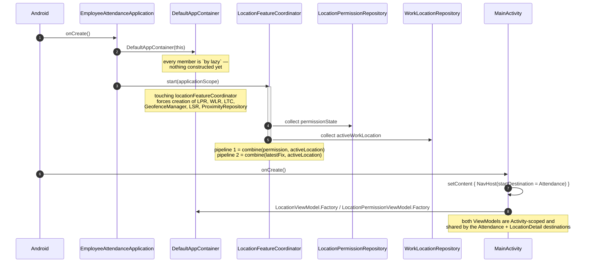
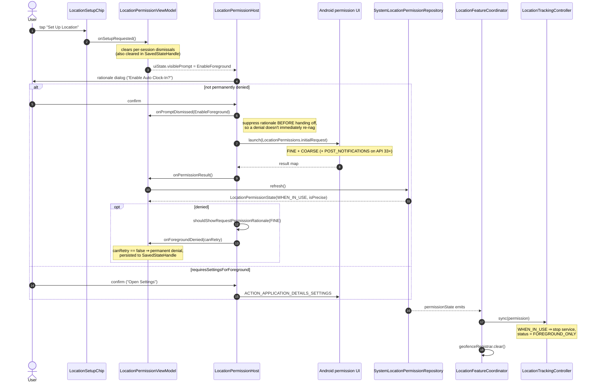
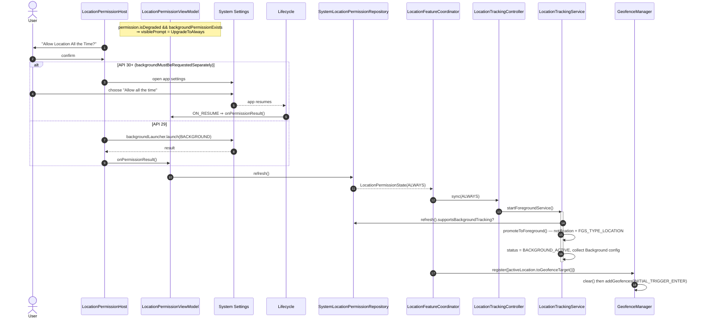
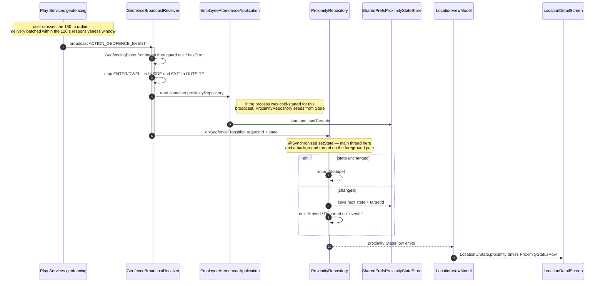
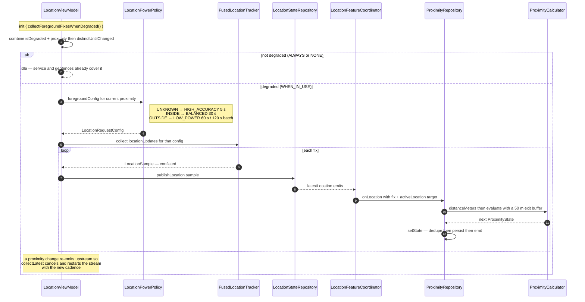
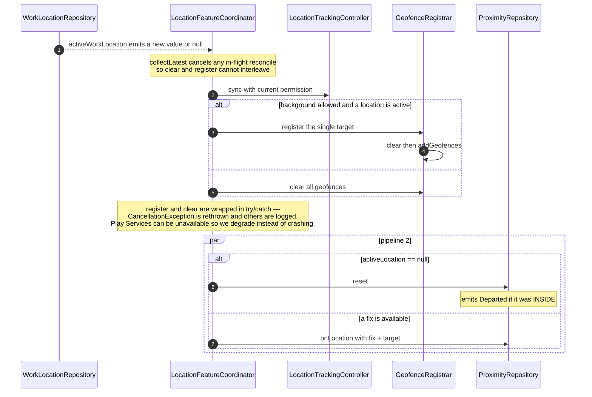
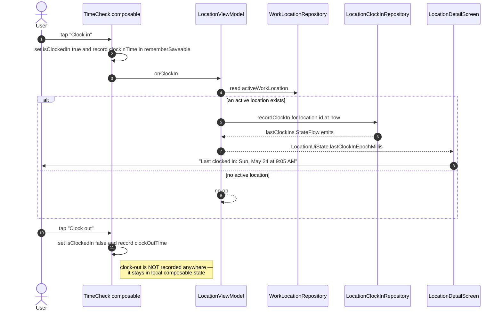
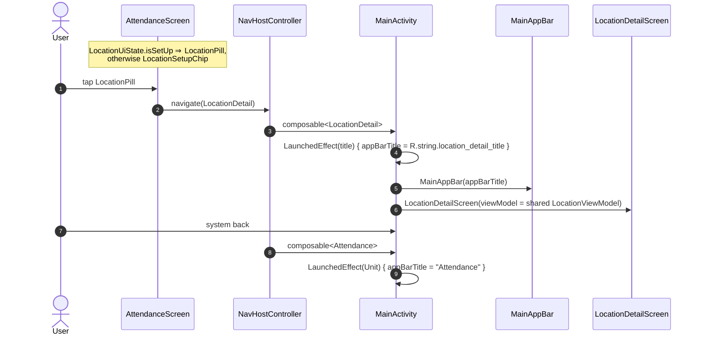

# Sequence Diagrams

The runtime flows that are hard to reconstruct by reading files in isolation. Each one names the
files involved so you can jump straight to the code.

---

## 1. App startup and coordinator wiring

**Files:** `EmployeeAttendanceApplication.kt`, `di/AppContainer.kt`,
`location/LocationFeatureCoordinator.kt`, `MainActivity.kt`

The coordinator starts **before** any UI exists and keeps running when the UI is gone. That is why
permission changes made in system Settings still reconcile tracking.

---

## 2. Permission request — first grant

**Files:** `location/ui/LocationPermissionHost.kt`, `location/ui/LocationPermissionViewModel.kt`,
`location/permission/LocationPermissionRepository.kt`, `location/LocationFeatureCoordinator.kt`

---

## 3. Upgrading to "Allow all the time"

**Files:** same as above, plus `location/geofence/GeofenceManager.kt`,
`location/tracking/LocationTrackingService.kt`

The `ON_RESUME` re-read in `LocationPermissionHost` is what makes the Settings round-trip work. If
you remove that `DisposableEffect`, the app will never notice a background grant.

---

## 4. Background proximity via OS geofences (the `ALWAYS` path)

**Files:** `location/geofence/GeofenceManager.kt`, `location/geofence/GeofenceBroadcastReceiver.kt`,
`location/proximity/ProximityRepository.kt`, `location/proximity/ProximityStateStore.kt`

`ProximityEvent`s currently have **no subscriber**. They are the deliberate integration seam for
auto clock-in — see [../features/proximity-and-geofencing.md](../features/proximity-and-geofencing.md).

---

## 5. Foreground proximity (the `WHEN_IN_USE` degraded path)

**Files:** `location/ui/LocationViewModel.kt`, `location/tracking/LocationPowerPolicy.kt`,
`location/tracking/LocationTracker.kt`, `location/LocationFeatureCoordinator.kt`,
`location/proximity/ProximityCalculator.kt`

This is the feedback loop that makes power usage adaptive: proximity picks the cadence, the cadence
produces fixes, the fixes update proximity. `collectLatest` is what makes the restart safe.

---

## 6. Reconciliation when the active work location changes

**Files:** `location/LocationFeatureCoordinator.kt`, `location/registration/WorkLocationRepository.kt`

---

## 7. Clock in from the attendance screen

**Files:** `ui/attendance/AttendanceScreen.kt`, `location/ui/LocationViewModel.kt`,
`location/registration/LocationClockInRepository.kt`, `location/ui/LocationDetailScreen.kt`

Note the asymmetry: clock-**in** reaches a repository, clock-**out** does not. Clock state also
lives in `rememberSaveable` inside the composable rather than in a ViewModel, so it is lost on
process death. Both are known gaps listed in
[../features/attendance.md](../features/attendance.md).

---

## 8. Navigation between destinations

**Files:** `MainActivity.kt`, `ui/attendance/AttendanceScreen.kt`, `ui/main/MainAppBar.kt`

Destinations are type-safe `@Serializable` objects (`Attendance`, `LocationDetail`) declared at the
top of `MainActivity.kt`, using Navigation-Compose's Kotlin-serialization routes. The app bar title
is Activity-level state driven by `LaunchedEffect` in each destination — add a destination and you
must set the title there too. Note the Attendance title is a hardcoded string while the detail
title comes from `strings.xml`.
