# Sequence Diagrams

The runtime flows that are hard to reconstruct by reading files in isolation. Each one names the
files involved so you can jump straight to the code.

---

## 1. App startup and coordinator wiring

**Files:** `EmployeeAttendanceApplication.kt`, `di/AppContainer.kt`, `statusupdate/AppForegroundTracker.kt`,
`ui/main/StartupGate.kt`, `MainActivity.kt`

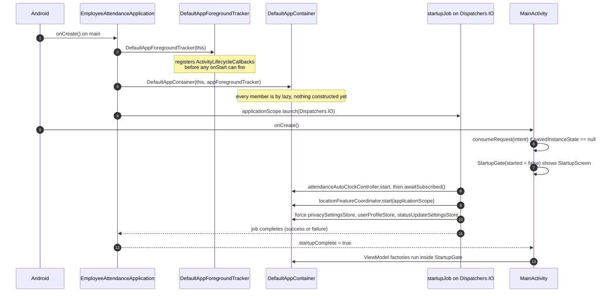

The coordinators start **before** any UI exists and keep running when the UI is gone. The UI waits on
`startupComplete` so no factory constructs an encrypted store on the main thread (issue #58).

---

## 2. Permission request — first grant

**Files:** `location/ui/LocationPermissionHost.kt`, `location/ui/LocationPermissionViewModel.kt`,
`location/permission/LocationPermissionRepository.kt`, `location/LocationFeatureCoordinator.kt`

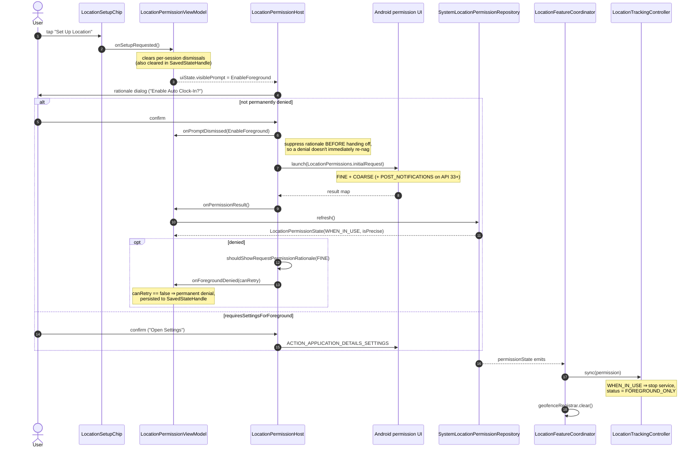

---

## 3. Upgrading to "Allow all the time"

**Files:** same as above, plus `location/geofence/GeofenceManager.kt`,
`location/tracking/LocationTrackingService.kt`

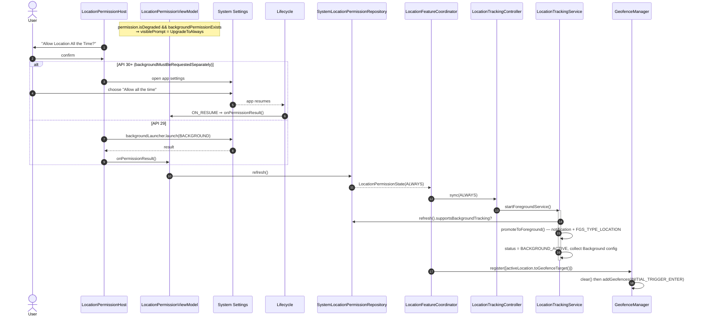

The `ON_RESUME` re-read in `LocationPermissionHost` is what makes the Settings round-trip work. If
you remove that `DisposableEffect`, the app will never notice a background grant.

---

## 4. Background proximity via OS geofences (the `ALWAYS` path)

**Files:** `location/geofence/GeofenceManager.kt`, `location/geofence/GeofenceBroadcastReceiver.kt`,
`location/proximity/ProximityRepository.kt`, `location/proximity/ProximityStateStore.kt`

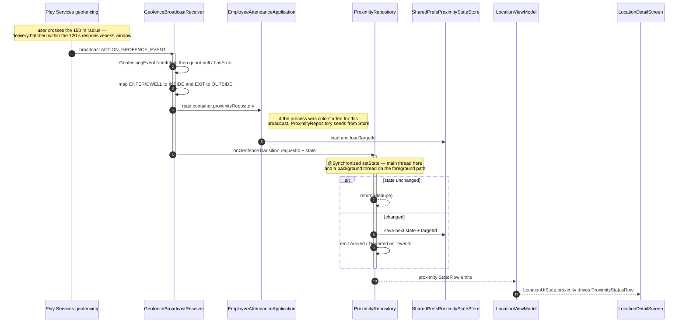

`ProximityEvent`s currently have **no subscriber**. They are the deliberate integration seam for
auto clock-in — see [../features/proximity-and-geofencing.md](../features/proximity-and-geofencing.md).

---

## 5. Foreground proximity (the `WHEN_IN_USE` degraded path)

**Files:** `location/ui/LocationViewModel.kt`, `location/tracking/LocationPowerPolicy.kt`,
`location/tracking/LocationTracker.kt`, `location/LocationFeatureCoordinator.kt`,
`location/proximity/ProximityCalculator.kt`

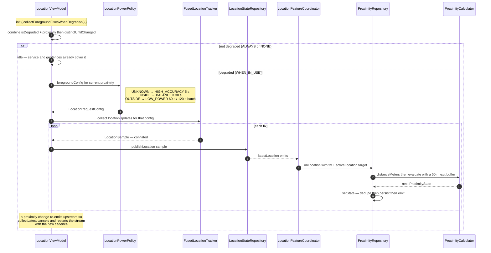

This is the feedback loop that makes power usage adaptive: proximity picks the cadence, the cadence
produces fixes, the fixes update proximity. `collectLatest` is what makes the restart safe.

---

## 6. Reconciliation when the active work location changes

**Files:** `location/LocationFeatureCoordinator.kt`, `location/registration/WorkLocationRepository.kt`

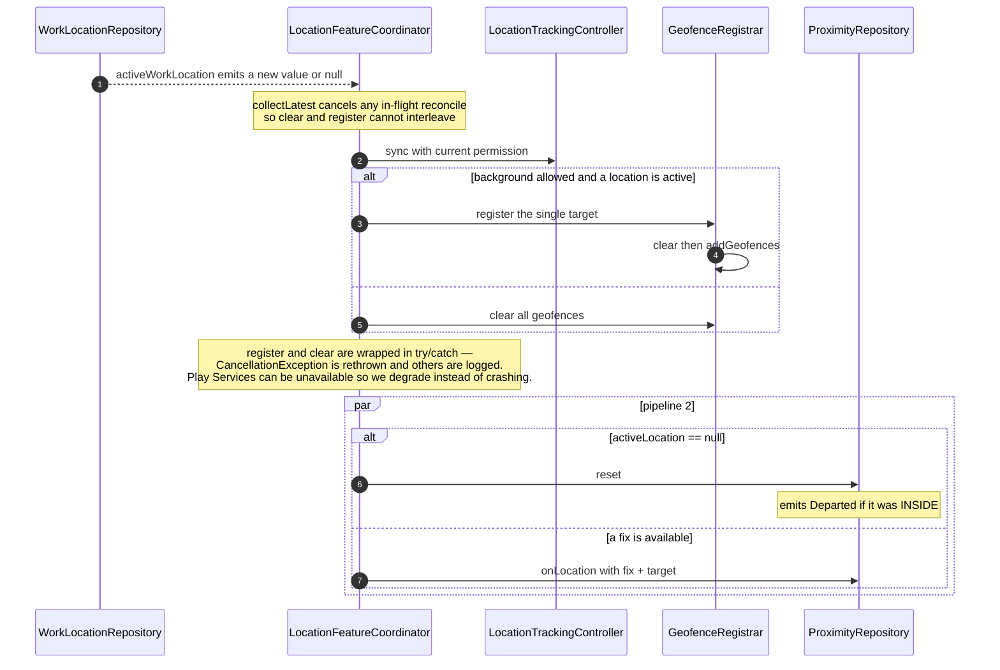

---

## 7. Manual clock-out from the attendance screen

**Files:** `location/ui/LocationViewModel.kt`, `attendance/AttendanceRepository.kt`,
`statusupdate/StatusUpdateCoordinator.kt`

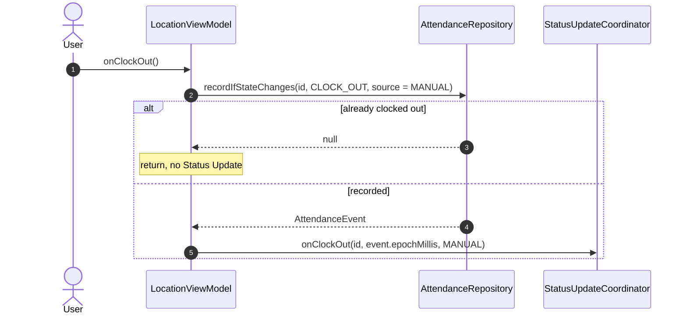

`id` is the active worksite's id, or `AttendanceRepository.GENERAL_TIMECLOCK_ID` when none is active.
What the coordinator does next is §10.

---

## 8. Navigation between destinations

**Files:** `MainActivity.kt`, `ui/attendance/AttendanceScreen.kt`, `ui/main/MainAppBar.kt`

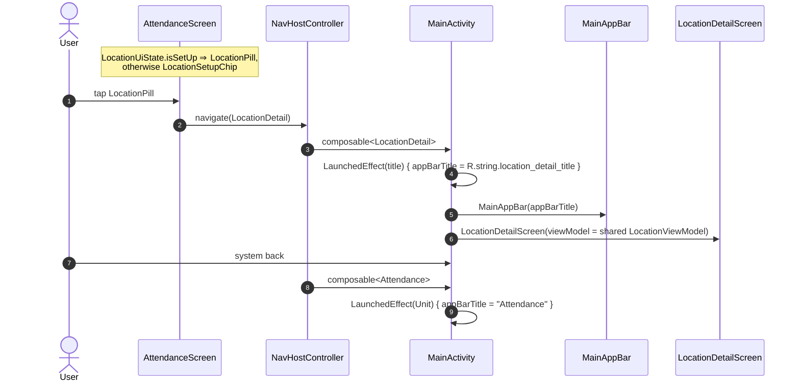

Destinations are type-safe `@Serializable` objects (`Attendance`, `LocationDetail`) declared at the
top of `MainActivity.kt`, using Navigation-Compose's Kotlin-serialization routes. The app bar title
is Activity-level state driven by `LaunchedEffect` in each destination — add a destination and you
must set the title there too. Note the Attendance title is a hardcoded string while the detail
title comes from `strings.xml`.

---

## 9. Switching to the Reports tab

**Files:** `MainActivity.kt`, `ui/main/MainBottomBar.kt`, `ui/reports/ReportsViewModel.kt`
    participant Bar as MainBottomBar
    participant Nav as NavHostController
    participant RS as ReportsScreen
    participant RVM as ReportsViewModel
    participant RG as ReportGenerator

    U->>Bar: tap Reports
    Bar->>Nav: navigateToTab(Reports)<br/>popUpTo(start){saveState}, restoreState
    Nav->>RS: composable<Reports>
    RS->>RVM: viewModel() — created on first visit, restored after
    RS->>RVM: collectAsStateWithLifecycle(selection, report, biweekly)
    RVM->>RG: report(period, eventLog, workLocations) on Dispatchers.Default
    RG-->>RVM: cached if the same period and list instances
    RVM-->>RS: ReportSection.Ready
    U->>Bar: tap Attendance
    Bar->>Nav: navigateToTab(Attendance) — Reports entry saved, not destroyed
```

The biweekly notification flow is drawn in
[../features/reporting.md](../features/reporting.md#biweekly-notification).

---

## 10. Status Update after a clock-out

**Files:** `attendance/ClockNotificationStrategy.kt`, `attendance/ClockActionReceiver.kt`,
`di/AppContainer.kt`, `statusupdate/StatusUpdateCoordinator.kt`, `statusupdate/StatusUpdateNotifier.kt`,
`statusupdate/StatusUpdateIntents.kt`, `MainActivity.kt`, `statusupdate/ui/StatusUpdateOverlayViewModel.kt`

### 10a. Choosing prompt or notification

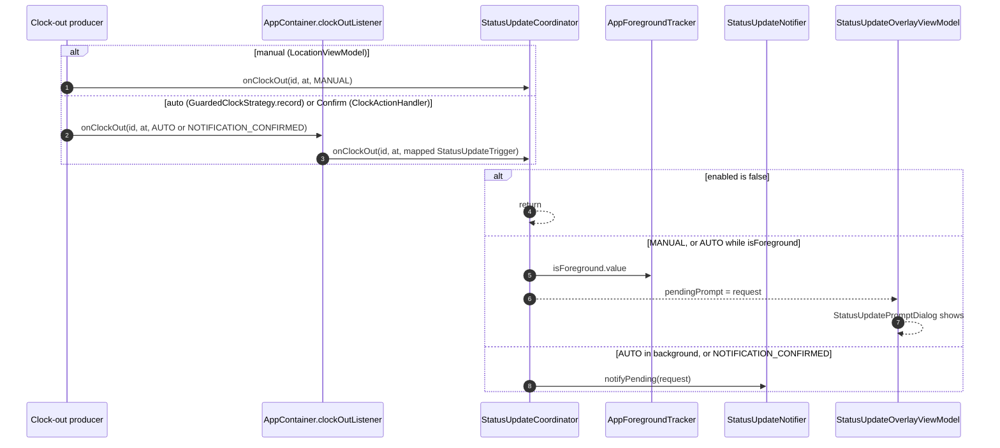

### 10b. Opening the deck from the notification

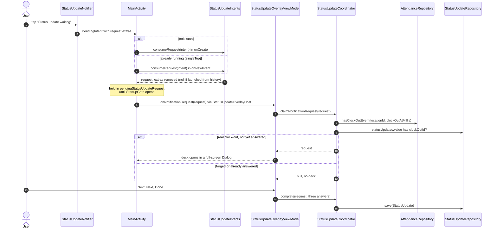

### 10c. Undo

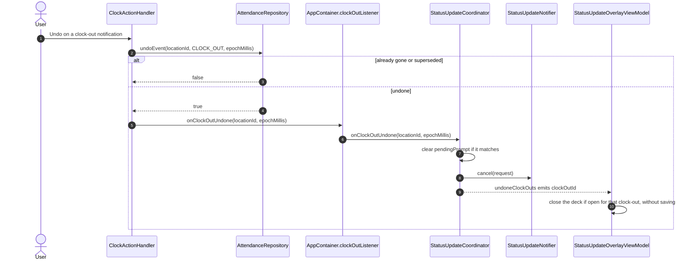

Dismissing the prompt, the notification, or the deck drops the request. Nothing resurfaces it.
See [../features/status-updates.md](../features/status-updates.md).
