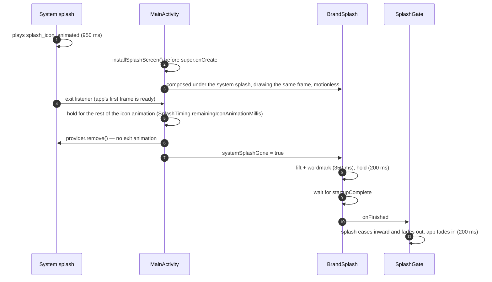

# Branding: app icons and the launch sequence

The launcher icon, the notification icon and the animated splash screen. The design source is
[`employee-attendance-assets/`](../employee-attendance-assets/): `overview-sheet.png` (palette and
everything at a glance), `android-icons/` (exported icons and their source SVGs), and
`splash/splash_motion_storyboard.png` (the six-step launch animation this page implements).

## Palette

| Name | Hex | Used for |
| --- | --- | --- |
| Sky blue | `#A9D2F2` | icon and splash background |
| Apricot | `#FFCF9E` | clock face |
| Deep blue | `#2E5E8C` | person, clock hands, wordmark |
| White | `#FFFFFF` | badge ring |

Defined twice, deliberately: `res/values/colors.xml` (`brand_*`, read by the launcher icon and the
system splash) and `ui/theme/Color.kt` (`Brand*`, read by Compose). Change both.

## Where things live

| File | What it is |
| --- | --- |
| `res/mipmap-anydpi-v26/ic_launcher*.xml` | adaptive icon: `@color/ic_launcher_background` + PNG foreground + PNG monochrome (themed icons) |
| `res/mipmap-{m,h,xh,xxh,xxxh}dpi/` | legacy square and round icons, and the adaptive foreground/monochrome layers, per density |
| `res/drawable-{m,h,xh,xxh,xxxh}dpi/ic_stat_notification.png` | white-on-transparent status-bar icon used by every notification |
| `app/src/main/ic_launcher-playstore.png` | the 512 px Play Store listing icon (not packaged into the APK) |
| `res/drawable/splash_icon.xml` | the splash icon at rest, as a vector |
| `res/drawable-v31/splash_icon_animated.xml` | the same icon as an `animated-vector`: storyboard steps 2-4 |
| `res/values{,-v31}/splash.xml` | `@drawable/splash_screen_icon`: static below Android 12, animated from 12 |
| `res/values/themes.xml` | `Theme.EmployeeAttendance.Starting`, `MainActivity`'s launch theme |
| `ui/splash/SplashTiming.kt` | every duration in the sequence, and the system-splash hold calculation |
| `ui/splash/BrandSplash.kt` | storyboard steps 5-6, drawn in Compose |
| `ui/main/SplashGate.kt` | shows `BrandSplash`, then cross-fades to the app |

To replace the icons, re-export from the asset pack and copy over the same paths; the adaptive-icon
XML and file names are what the pack produces.

## The launch sequence

The storyboard is 1.7 s, split across the system and the app:

| Step | Time | Who draws it |
| --- | --- | --- |
| 1 Start: flat sky blue | 0 ms | system splash (`windowSplashScreenBackground`) |
| 2 Person assembles | 0-250 ms | system splash, animated icon (Android 12+) |
| 3 Clock badge pops | 250-550 ms | 〃 |
| 4 Hand sweeps 12 → 3 | 550-950 ms | 〃 |
| 5 Icon lifts, wordmark rises | 950-1300 ms | `BrandSplash` |
| 6 Hold, then ease inward and cross-fade | 1300-1700 ms | `BrandSplash`, then `SplashGate`'s transition |

What makes the hand-off seamless, and must stay true:

- **`BrandSplash`'s first frame is the system splash's last.** Same background, same vector
  (`splash_icon.xml` is the final frame of `splash_icon_animated.xml`), same 288 dp size, centred.
  That is why the system splash is removed with no exit animation. Change the artwork in both
  drawables together.
- **`BrandSplash` does not move until the system splash is gone.** It is composed underneath it; if
  it started then, a fast start would play the wordmark out of sight. A launch that shows no system
  splash never calls the exit listener, so `MainActivity` also starts it after
  `SYSTEM_SPLASH_FALLBACK_MILLIS`.
- **The splash provider's start time is epoch milliseconds**, not `uptimeMillis()`. The hold is
  clamped to the animation length so a clock change can never strand the splash.
- **`SplashGate` does not compose the app behind the splash**, like `StartupGate` and
  `OnboardingGate`, so the location permission prompt cannot appear over it.
- **`BrandSplash` waits for `startupComplete`** before handing off, so a slow cold start holds on the
  brand screen instead of cutting to `StartupScreen`'s spinner.
- **It plays only on a fresh launch** (`savedInstanceState == null`). A recreated activity goes
  straight to the app.
- **One accessibility node.** The splash is announced as the app name. Its "Attendance" wordmark is
  not exposed as text, which also keeps it from satisfying instrumentation tests that wait for the
  app bar's "Attendance" title.

Below Android 12 the compat splash shows the static icon on sky blue (it cannot animate), then
`BrandSplash` plays steps 5-6 as normal.

On a cold debug build the first frame can take longer than the 950 ms icon animation. The system
splash then sits on the finished icon until the app is ready, which is expected.

The wordmark uses the platform sans-serif in bold, not the geometric face in the asset pack's
mock-up; no font is bundled.

## Tests

| Test | Layer | Covers |
| --- | --- | --- |
| `SplashTimingTest` | JVM | the hold calculation: mid-animation, after, pre-Android 12, clock set back; and that `SplashTiming.ICON_ANIMATION_MILLIS` matches the theme's `windowSplashScreenAnimationDuration` |

The animation itself is verified by recording a launch on an emulator **with animations enabled**:
the instrumentation emulator runs with all animation scales at 0, which shows a static icon.
