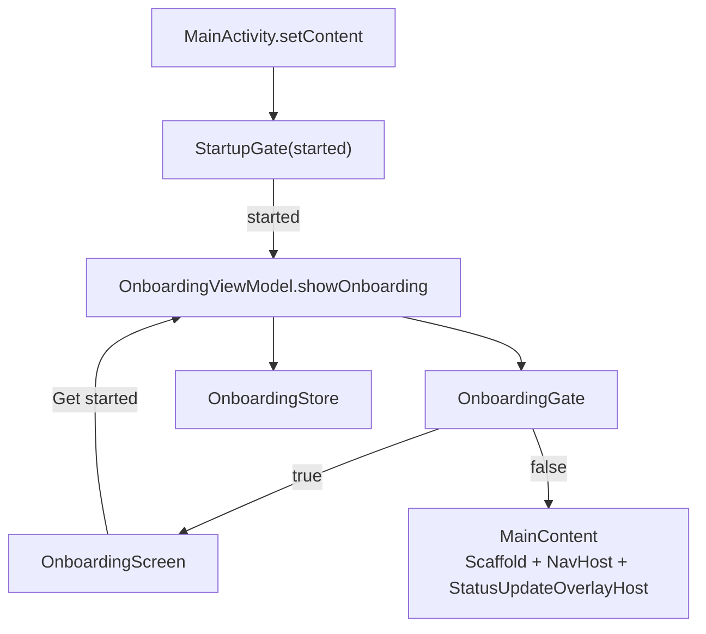

# Feature: First-launch onboarding

The first time the app opens, it shows a three-page carousel before the home screen. Each page
covers one feature area:

| Page | Feature label | Headline |
| --- | --- | --- |
| 1 | Attendance | Clock in & out: tracking clock-in/out and the live clock |
| 2 | Worksites | Add your worksites: location-based registration and automatic clock-in |
| 3 | Reporting | Status reports: the end-of-day status update and the biweekly summary |

The user can swipe between pages or press **Next**. On the last page the button reads **Get
started**. Pressing it records completion and opens the app on its designated home screen
(`AppNavGraph.root`, currently Attendance), with no transition animation. Onboarding never shows again after that. Swiping alone never finishes the flow. System
back goes to the previous page; on the first page it leaves the app, as it would anywhere else.

---

## Code map

All paths are under `EmployeeAttendance/app/src/main/java/com/jaustinjr/employeeattendance/`.

| File | Role |
| --- | --- |
| `onboarding/OnboardingStore.kt` | `OnboardingStore` (seam) and `SharedPrefsOnboardingStore`: the `completed` flag, `SecurePreferences` file `onboarding`; `resetForNextLaunch()` and `resetPending` for the developer replay |
| `onboarding/OnboardingPage.kt` | `OnboardingPage` (page order and copy), `OnboardingAction`, and the pure `onboardingActionFor(currentPage, pageCount)` |
| `onboarding/ui/OnboardingViewModel.kt` | `showOnboarding`, seeded synchronously from the store; `complete()`; the `Factory` |
| `onboarding/ui/OnboardingScreen.kt` | `OnboardingScreen` (owns the `PagerState` and `BackHandler`), stateless `OnboardingContent`, `OnboardingPrimaryButton`, `ONBOARDING_PAGER_TAG` |
| `onboarding/ui/OnboardingComponents.kt` | `OnboardingPageContent`, `OnboardingIllustration` (tonal disc plus badge), `OnboardingPageIndicator` |
| `ui/main/OnboardingGate.kt` | `OnboardingGate`: chooses carousel or app, switching between them without animation |
| `MainActivity.kt` | builds `OnboardingViewModel` inside `StartupGate`; the app body is `MainContent`, composed only through `OnboardingGate` |

---

## How it fits in

The gates nest. `StartupGate` waits for startup wiring (issue #58). `OnboardingGate` then picks the
carousel or the app.

- **The app is not composed behind the carousel.** This works the same way as `StartupGate`: while
  `showOnboarding` is true, `MainContent` is not composed at all. If it were, the location
  ViewModels would be built and `LocationPermissionHost` would show its location rationale dialog
  over the onboarding. `OnboardingGateTest` counts compositions to check this.
- **Deep links wait.** `openReportsOnStart` and `pendingStatusUpdateRequest` are only read inside
  `MainContent`. A notification tap that cold-starts a fresh install lands after onboarding and
  isn't dropped.
- **No flash for returning users.** `showOnboarding`'s initial value is read synchronously from
  `store.completed.value`, so the gate's first frame is already right, and a returning user goes
  straight to the home screen.
- **Home is whatever `AppNavGraph.root` names.** The app's `NavHost` takes its `startDestination`
  from `AppNavGraph.root.route` rather than naming a screen. Finishing onboarding composes the app,
  which opens on that destination exactly like a normal launch. Neither the gate nor onboarding
  names a screen, so moving home is a change to `AppNavGraph.root` alone (plus the Reports deep
  link, which navigates from inside the root's `composable` block).
- **The store is forced in `startupJob`.** `OnboardingViewModel.Factory` is the first factory to run
  after `StartupGate` opens, and the store is backed by `EncryptedSharedPreferences`. See
  [overview §8](../architecture/overview.md#8-constraints-the-architecture-depends-on).
- **Backup-excluded** like every other store (`onboarding.xml` and `onboarding_secure.xml` in both
  rule files, enforced by `BackupRulesTest`). A reinstall or a device transfer shows onboarding
  again.

## Design

The rough drafts were redrawn with the app's Material 3 theme. There are no hard-coded colours, so
dynamic colour and dark theme both work.

- **Illustration:** a large Material icon on a `primaryContainer` disc, with a smaller badge icon on
  a `tertiaryContainer` disc. This is the drafts' clock and briefcase idea, reused on every page:
  schedule + work, location pin + my-location, checked clipboard + insights. It is decorative and
  hidden from accessibility services.
- **Text:** a `labelLarge` feature label in `primary`, a `headlineMedium` headline (a semantic
  heading), a `bodyLarge` body, and `bodyMedium` supporting text in `onSurfaceVariant`. Each page
  scrolls vertically, so large font sizes never clip.
- **Indicator:** the current page's dot stretches into a `primary` pill, and the change is animated.
  TalkBack reads it once as "Page x of y".
- **Pager:** pages fade and shrink slightly as they slide away (`getOffsetDistanceInPages`, read
  in `graphicsLayer` so scrolling doesn't recompose).
- **Exit:** none. The frame after **Get started** is the home screen; `NavHost` draws its start
  destination fully on its first frame.
  - Why no animation: two animated hand-offs were tried (a cross-fade, then the home screen fading
    in over the carousel). Both showed a white flash on device, because the window background is
    the platform default white even in dark theme. Don't reintroduce one without checking every
    frame on a device.

## How it knows not to show again

Tapping **Get started** calls `OnboardingViewModel.complete()` → `OnboardingStore.markCompleted()`.
That sets `completed = true` in the encrypted `onboarding` prefs file. On every later launch, the
store reads the flag when `startupJob` constructs it. `OnboardingViewModel.showOnboarding` is
`!completed`, so `OnboardingGate` goes straight to the app.

## Replaying it

In a debug build: Developer Settings (tap the Attendance title five times) → **Onboarding** →
**Show onboarding on next launch**, then close the app from Recents and reopen it.

The button calls `OnboardingStore.resetForNextLaunch()`. It clears the persisted flag but **not**
the running process's `completed`, so the current session carries on. Flipping the live flag would
make `OnboardingGate` swap the carousel in immediately and dispose of the developer screen that
asked for it. `resetPending` reports that a reset is waiting for a restart, and the developer screen
shows it. Outside the developer tools, `adb shell pm clear com.jaustinjr.employeeattendance` gets the
same result, wiping all app data.

## Changing it

- **Add, remove, or reorder a page:** edit `OnboardingPage` and its strings, and add the page's
  icons in `OnboardingComponents`. Update `OnboardingActionTest`'s order assertion and
  `OnboardingScreenTest`'s walkthrough.
- **Show onboarding again to everyone** (for example, after a major release): call
  `resetForNextLaunch()` from a migration, or bump the key. Don't delete the prefs file, because the
  store's `StateFlow` is cached for the life of the process.
- **Tests that launch the real `MainActivity`** must call `container.onboardingStore.markCompleted()`
  first, as `ReportsDeepLinkTest` and `StatusUpdateNotificationLaunchTest` do. Otherwise they land
  on the carousel.

## Tests

| Test | Layer | Covers |
| --- | --- | --- |
| `OnboardingActionTest` | JVM | `onboardingActionFor`; page order |
| `OnboardingViewModelTest` | JVM | synchronous seed for first-launch and returning users; `complete()` |
| `SharedPrefsOnboardingStoreTest` | androidTest | default, immediate update, persistence across instances, reset-for-next-launch affecting only a fresh instance |
| `OnboardingScreenTest` | androidTest | Next walks every page, Get started finishes, swiping advances without finishing |
| `OnboardingGateTest` | androidTest | the app is not composed behind onboarding; finishing switches to the app on the very next frame, composing it once and removing the carousel |
| `BackupRulesTest` | JVM | `onboarding` is excluded from backup and device transfer |
