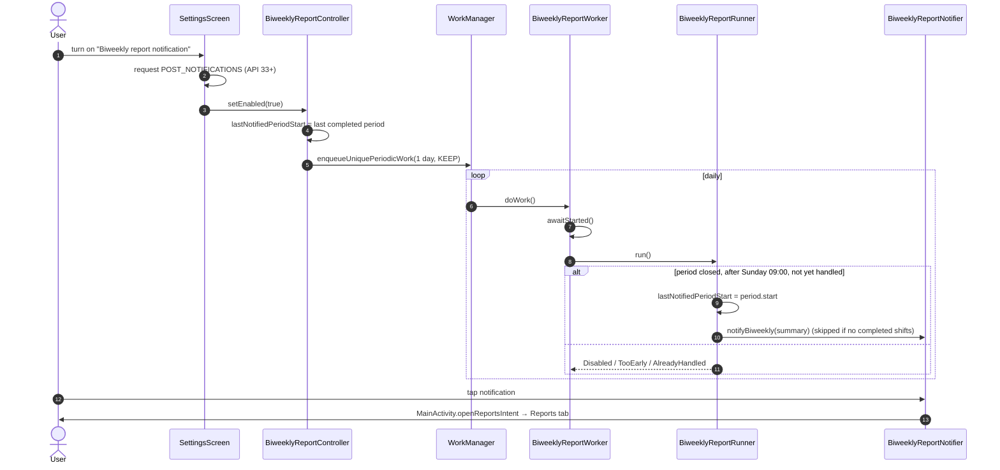

# Feature: Reporting

The **Reports** tab analyses the user's clock in/out history. It sits beside Attendance in the
bottom navigation bar; Attendance stays the start destination and home.

- Weekly (Sunday to Saturday) or monthly history, paged backwards and up to the current period.
- Stats: total worked, shifts, days worked, average per day worked, longest shift, average clock-in.
- Vico charts: hours by day (columns) and time by worksite (donut with a value legend).
- A **biweekly summary card**: the most recent completed two-week period, compared with the one before.
- **Share** (system share sheet: Google Drive, Files, messaging, email) and **Email** (mail apps only)
  of the displayed report as a `.txt` file.
- An opt-in **biweekly notification** in Settings, posted every other Sunday.

Shifts still in progress are never counted. When the user is clocked in, the screen, the shared file
and the report all say so (see [Active shifts](#active-shifts)).

## Code map

| File | Role |
| --- | --- |
| `reporting/ReportPeriod.kt` | `ReportPeriodType` (`WEEK`, `BIWEEKLY`, `MONTH`) and aligned, half-open `ReportPeriod`s; the fixed biweekly anchor |
| `reporting/WorkSession.kt` | `SessionLog.from(events)`: pairs clock-ins with clock-outs into completed `WorkSession`s and open `ActiveShift`s |
| `reporting/AttendanceReport.kt` | report models and `ReportCalculator` (clipping, midnight splits, totals, averages) |
| `reporting/ReportGenerator.kt` | cached entry point shared by the screen and the worker; also computes the `ActiveShiftNotice` and `BiweeklySummary` |
| `reporting/ReportTextFormatter.kt` | plain-text rendering (`ReportStrings` holds the templates so it runs on the JVM) |
| `reporting/ReportSharer.kt` | `ReportSharer` seam + `FileReportSharer` (writes `cacheDir/reports`, `ACTION_SEND`) |
| `reporting/ReportFileProvider.kt`, `res/xml/report_paths.xml` | the release `FileProvider`, scoped to `cacheDir/reports` |
| `reporting/BiweeklyReport.kt` | `ReportScheduler` and `ReportNotifications` seams, `BiweeklyReportController` (opt-in), `BiweeklyReportRunner` (one daily check) |
| `reporting/BiweeklyReportWorker.kt` | `BiweeklyReportWorker`, `WorkManagerReportScheduler`, `BiweeklyReportNotifier` |
| `settings/ReportSettingsStore.kt` | `ReportSettings` seam: opt-in flag and last handled period |
| `ui/reports/ReportsViewModel.kt` | per-section `StateFlow`s, period paging, share |
| `ui/reports/ReportsScreen.kt` | stateful `ReportsScreen` + stateless `ReportsContent` |
| `ui/reports/ReportCharts.kt` | `DailyHoursChart`, `WorksiteShareChart` |
| `ui/main/MainBottomBar.kt` | the M3 `NavigationBar` and `NavController.navigateToTab` |
| `attendance/AttendanceRepository.kt` | `eventLog`: the read-only event log reporting is built on |

## Where the data comes from

`AttendanceRepository.eventLog` exposes the append-only event log. Every mutation publishes a **new
list instance** and never mutates one already emitted; `ReportGenerator` relies on that to cache by
identity (see [Performance](#performance)). If you add a mutation path to
`DefaultAttendanceRepository`, it must go through `publish()`.

Worksite names come from `WorkLocationRepository.workLocations`. A total is labelled with a
`WorksiteLabel` rather than a string: `Registered(name)`, `GeneralTimeclock` (manual clock in/out
with no worksite, `GENERAL_TIMECLOCK_ID`) or `Removed` (history for a deleted worksite). Labels are
resolved to text only at display time, so a locale change is never stale.

## Calculation rules

| Rule | Behavior |
| --- | --- |
| Pairing | per worksite, in time order. A clock-in while a shift is open is ignored (earliest start wins); a clock-out with no open shift is ignored; zero-length shifts are dropped |
| Weeks | Sunday 00:00 to the next Sunday 00:00, device zone |
| Biweekly | 14 days from a fixed Sunday anchor (`2023-01-01`), so pairs never shift with install or opt-in date |
| Months | calendar month |
| Clipping | only the part of a shift inside the period counts toward it |
| Midnight | a shift is split at each local midnight (`atStartOfDay`, so 23- and 25-hour DST days are exact) |
| Longest shift | the whole shift's duration, even when it is clipped |
| Average clock-in | mean time of day of shifts that **started** in the period |
| Average per day | total ÷ days with any work |

## Active shifts

An open clock-in is excluded from every total and chart. `ReportGenerator.activeShiftNotice` returns
the open shift that overlaps the viewed period, and:

- the screen shows it in a note card above the stats;
- the shared text file includes the same sentence under the title;
- the biweekly notification only ever covers a period that has already ended, and a shift still open
  when it ends contributes nothing to it.

## Performance

| Mechanism | Where |
| --- | --- |
| No work until the tab is opened | `ReportsViewModel` is scoped to the Reports back-stack entry |
| Tab switches keep the ViewModel | `navigateToTab` pops with `saveState` and navigates with `restoreState` |
| Off the main thread, stale work cancelled | `mapLatest { withContext(Dispatchers.Default) { … } }` |
| Revisiting a period is free | `ReportGenerator` LRU (16 entries) keyed by period + zone, valid for the exact `eventLog`/`workLocations` instances (`===`) |
| Pairing done once per log | `SessionLog` cached for the last event-log instance |
| Lifecycle | `collectAsStateWithLifecycle` (stops at `onStop`, not `onPause`, so a report behind a dialog or in multi-window stays live) + `WhileSubscribed(5_000)` so a rotation recomputes nothing |
| Recomposition | selection, report and biweekly are separate flows; `ReportsContent` sections take only their slice, `ReportsActions` is remembered once, and chart models are `remember(days)` / `remember(worksites)` |
| No layout jump | `ReportSkeleton` is sized like the stats and chart it replaces |

## Sharing

`FileReportSharer` writes `attendance-report-<type>-<start>.txt` to `cacheDir/reports` (deleting the
previous file first), resolves it through `ReportFileProvider` (authority
`${applicationId}.reports`) and launches a chooser for `ACTION_SEND` `text/plain` with
`EXTRA_STREAM`, `ClipData` and `FLAG_GRANT_READ_URI_PERMISSION`.

- **Share** leaves the target open: Google Drive appears as "Save to Drive", so no Drive SDK, OAuth
  or network permission is involved.
- **Email** sets a `mailto:` selector, which restricts resolvers to mail apps while keeping the
  attachment.

`ReportFileProvider` is a `FileProvider` **subclass** on purpose: the debug manifest already declares
`androidx.core.content.FileProvider` for developer logs, and two providers with the same class name
would collide in the manifest merge. The cache directory is not part of backups.

## Biweekly notification

Why a **daily** check rather than a 14-day periodic job: periodic work drifts later with every
deferred run, while a daily check always lands on the first run after the boundary, and
`lastNotifiedPeriodStart` makes it idempotent. Opting in marks the last completed period as handled
so the user is not immediately notified about a fortnight that ended long ago.

WorkManager's default startup initializer is removed in the manifest. `EmployeeAttendanceApplication`
implements `Configuration.Provider`, and the first WorkManager call is
`biweeklyReportController.reconcile()` inside the startup job on `Dispatchers.IO`, keeping its
database open off the main thread. `reconcile()` uses `KEEP`, so it never resets the next run.

The permission request lives in the stateful `SettingsScreen` wrapper: only a composable can own an
`ActivityResult` launcher, the same reason `LocationPermissionHost` exists. If the user denies it,
the switch stays off and an explanation is shown.

## Dependencies

| Library | Version | Why pinned there |
| --- | --- | --- |
| Vico `compose`, `compose-m3` | 3.1.0 | built on Compose 1.10.3 and Kotlin 2.3 — covered by the Compose BOM and readable by the project's Kotlin 2.2 compiler. 3.2.x pulls Compose 1.11 and 3.3.x needs Kotlin 2.4, so lint's "newer version" warning is expected |
| WorkManager `work-runtime-ktx` / `work-testing` | 2.11.2 | |
| `desugar_jdk_libs` | 2.1.5 | `java.time` on minSdk 24 (`isCoreLibraryDesugaringEnabled`) |

## Tests

| Test | Layer | Covers |
| --- | --- | --- |
| `ReportPeriodTest` | JVM | Sunday weeks, month lengths, biweekly tiling from the anchor |
| `SessionLogTest` | JVM | pairing rules, active shifts |
| `ReportCalculatorTest` | JVM | totals, midnight split, clipping, both DST transitions, worksite labels |
| `ReportGeneratorTest` | JVM | cache hits/invalidation/eviction, active-shift notice, biweekly comparison |
| `ReportTextFormatterTest` | JVM | text output, active-shift note, empty report |
| `BiweeklyReportTest` | JVM | opt-in bookkeeping, delivery time, once per period, empty periods |
| `ReportsViewModelTest` | JVM | lazy start, paging limits, type switching, cache reuse, `mapLatest` cancellation, share |
| `ReportsScreenTest` | androidTest | rendering, active-shift card, empty and loading states, callbacks |
| `BottomBarNavigationTest` | androidTest | home tab, tab state restore, no tab stacking, bar hidden on children |
| `ReportsDeepLinkTest` | androidTest | the notification intent opens Reports on the real `MainActivity` |
| `FileReportSharerTest` | androidTest | file written and readable via the provider, one file kept, provider scope, intent shape |
| `BiweeklyReportPlatformTest` | androidTest | unique daily periodic work, worker wiring, the posted notification |
| `ReportSettingsStoreTest` | androidTest | persistence |

## Where to make common changes

| Change | Edit |
| --- | --- |
| A new stat | `AttendanceReport` + `ReportCalculator`, then `StatGrid` and `ReportTextFormatter.fullReport` |
| Week start day | `ReportPeriod.startOfWeek` (and the biweekly anchor must be that weekday) |
| Notification time | `BiweeklyReportRunner.DELIVERY_TIME` |
| Chart look | `ReportCharts.kt`; colors come from `MaterialTheme.colorScheme` |
| Another tab | `AppNavGraph` (parentless destination + `topLevel`), `MainBottomBar` icon/label, `composable<…>` in `MainActivity` |
