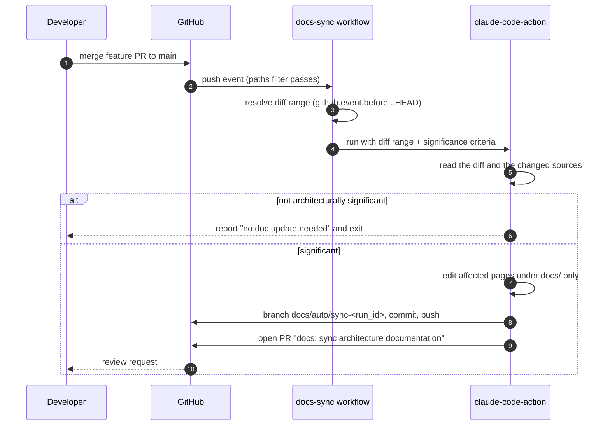

# Keeping Documentation in Sync

Two mechanisms keep `docs/` honest: what you do in your PR, and the automated
[Docs Sync workflow](../../.github/workflows/docs-sync.yml) that catches what you missed.

## What you own

Update docs in the **same PR** as the code whenever your change:

- adds/removes/renames a class, interface, ViewModel, repository, screen, `Service`, or receiver;
- changes a dependency edge (new constructor param, new `AppContainer` binding, a consumer reading a
  different repository);
- changes behavior of a hub class (see [change-impact-map.md](change-impact-map.md));
- alters a flow drawn in [sequence-diagrams.md](../architecture/sequence-diagrams.md);
- changes a documented invariant or tuning constant (power cadences, 50 m hysteresis buffer, 120 s
  geofence responsiveness, the single-active-target assumption);
- adds a navigation destination, Android permission, manifest component, or SDK/Gradle version;
- replaces a documented stub or closes a listed "known gap".

### Which page to touch

| You changed | Update |
| --- | --- |
| a class/interface, or a relationship between them | the package's diagram in [class-diagrams.md](../architecture/class-diagrams.md) **and** the hub graph at the bottom |
| a runtime flow | [sequence-diagrams.md](../architecture/sequence-diagrams.md) |
| layering, DI, scopes, threading, or a stub | [overview.md](../architecture/overview.md) |
| behavior a developer would look up by feature | the matching [features/](../features/) guide |
| a dependency edge or an invariant | [change-impact-map.md](change-impact-map.md) — both the per-file table and the reverse index |
| build setup or conventions | [onboarding.md](../onboarding.md) |
| the doc set itself | [README.md](../README.md) index |

A single new dependency usually means **three** edits: the feature guide, the class diagram (plus
the hub graph), and the change-impact map's reverse index. That is the most commonly missed one.

## The Docs Sync workflow

`.github/workflows/docs-sync.yml`

**Trigger.** A push to `main` or `develop` that touches `EmployeeAttendance/app/src/main/**`,
`app/build.gradle.kts`, `settings.gradle.kts`, or `gradle/libs.versions.toml`. Because that filter
only matches source under `EmployeeAttendance/`, a docs-only push never triggers the workflow and it
cannot loop. (GitHub Actions rejects `paths` and `paths-ignore` on the same event, so the exclusion
comes from keeping `paths` narrow rather than from an ignore list.) Also available via
`workflow_dispatch` with an optional `base_ref` for backfilling.

**Why on push, not on the PR.** The docs PR then describes code that actually shipped, and it never
churns against review iterations on the feature PR. The trade-off is that docs briefly lag `main` —
acceptable, because the primary path is still updating docs in the feature PR.

**What it does.**

**Guardrails built in:**

- The path filter is only a cheap pre-gate; the significance decision is made against explicit
  criteria in the prompt, and cosmetic changes produce no PR.
- Scope is restricted to `docs/` — the workflow cannot modify source.
- `concurrency` cancels a superseded in-flight run per branch.
- The job skips commits whose message starts with `docs: sync architecture documentation`, so
  merging its own PR doesn't loop.
- Branch names are unique per run (`docs/auto/sync-<run_id>`).
- Tool permissions are passed via the `settings` JSON, not `claude_args` — `claude_args` splits on
  whitespace and mangles patterns like `Bash(gh pr create:*)`
  (anthropics/claude-code-action#844). The same workaround is used in `code-review.yml`.

**Requirement.** The repository secret `CLAUDE_CODE_OAUTH_TOKEN` must be set — the same one
`code-review.yml` uses.

## Reviewing a Docs Sync PR

It is generated, so review it like generated work:

1. **Verify claims against the source.** Anything asserting behavior must be checkable in the diff.
2. **Check the diagrams render.** Open the Files-changed view; GitHub renders Mermaid natively. A
   syntax error shows as a raw code block.
3. **Check completeness, not just correctness.** The common failure is updating one page and missing
   the class diagram or the reverse index.
4. **Read the "unsure about" section** in the PR body — the prompt asks it to flag guesses rather
   than invent. Confirm or correct those.
5. **Make sure nothing outside `docs/` changed.**
6. Close it without merging if the change turned out to be insignificant; that costs nothing.

## Relationship to the code review workflow

`code-review.yml` reviews an **opened PR** (and re-runs on `@claude` comments) for quality, bugs,
performance, security, and test coverage. `docs-sync.yml` runs **after merge** and only writes
documentation. They don't overlap and neither blocks the other.
